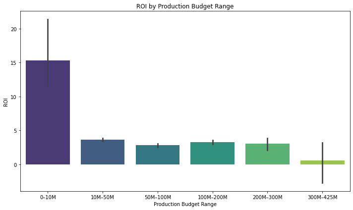
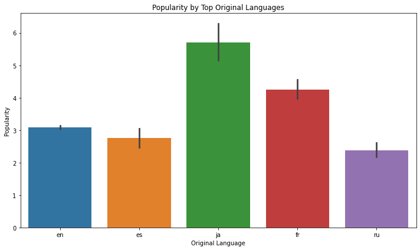

<<<<<<< HEAD
# FILM INDUSTRY ANALYSIS FOR GOLDEN ARC PICTURES
## 1.0 Project Overview
This project is about analysis of the film industry to help Golden Arc Pictures make more informed decisions. The analysis is based on data provided  by various film industry companies. The analysis involves Exploratory Data Analysis(EDA) on various datasets to identify trends in successful films and thus helping us come up with actionable business recommendations.
## 2.0 Business Understanding
The aim is to guide Golden Arc Pictures in identifying what type of film is more likely to succeed at the box office based on the historical performance of other movie studios in the box office market. The analysis is based on the following data sources;
## 3.0 Data sources
  - Box Office Mojo: Gross earnings and box office performance.
  - Rotten Tomatoes: Critic and audience scores.
  - IMDb Links: Unique identifiers to cross-reference movies across datasets.
  - TheMovieDB: Provides data on movies including genres, languages, production countries, popularity, and more.
  - The Numbers: Gives us financial details such as production budgets and revenues to help calculate ROI.
### 3.1 Stakeholders Needs
 - Maximize profit by identifying the most profitable genres.
 - Minimize risk by avoiding investment with movie genres with poor ROI
### 3.2 Key Business Questions
  - What is the impact of language on popularity?
  - What effect does runtime have on rating?
  - Is there a relationship between production budget and ROI?
## 4.0 Data Understanding
This is divided into four different steps that were handled collaboratively by each member.
### 4.1 Data Exploration
This step was aimed at each member familiriazing themselves with the datasets provided,i.e:
 - Identifying the important columns that will help with the analysis.
 - Finding missing values and duplictes and any inconsistency in the data e.g Outliers.
 - Identifying potential relationship in the datasets columns to help in more exploration.
 - Checking for information and the datatypes to enable cleaning of the data.
### 4.2 Data Cleaning
After the Data exploration we moved to the next step of data cleaning.We;
 - Removed the none numerical characters(punctuaction marks)
 - Handled missing values and inconsitencies by dropping them
 - Standardized the date formats,i.e Separated the year and month
 - Did some feature engineering by adding new columns such as, Revenue,Profit and ROI.
 - Converted release_date into datetime format.
This steps ensured that we have cleaned data to help with visualizations and build models that will gives us a more deepen insight.
### 4.3  Visualization
The aim of the visualization is to check for relationship between different column to draw insights that will help with our analysis and findings thus giving recommendations.We used;
  - A Barplot - To show the relationship between Production Revenue and ROI
  - A Barplot - To show the effect of runtime to ratings
  - A Histogram - To show how revenue is distributed across different studios
  - A Barplot - Showing the average rating per genre
### 4.4 Hypothesis Testing
The aim of the hypothesis testing was to statistically challenge or support the finding on the visualization analysis.

- We used the ANOVA
- We focused on validating different insights,like;
=======
# ANALYSIS OF FILM INDUSTRY FOR BUSINESS VENTURE RECOMMENDATION.
## Project Overview
This project is about analysis of the film industry to help our company make more informed decisions. The analysis is based on data provided various film industry companies. The analysis involves exploratory data analysis(EDA) on various datasets to identify trends in successful films and thus helping us come up with actionable business recommendations.
## Business Understanding
The aim is the guide a new movie studio in identifying what type of film is more likely to succeed at the box office based on the historical performnace of other movie studios in the box office market. The analysis is based on the following data sources;
## Data sources
 *Box Office Mojo: Gross earnings and box office performance.
 *Rotten Tomatoes: Critic and audience scores.
 *IMDb Links: Unique identifiers to cross-reference movies across datasets.
 *TheMovieDB: Provides data on movies including genres, languages, production countries, popularity, and more.
 *The Numbers: Gives us financial details such as production budgets and revenues to help calculate ROI.
### Stakeholders Needs
*Maximize profit by identifying the most profitable genres.
*Minimize risk by avoiding investment with movie genres with poor ROI
### Key Business Questions
  * What is the impact of language on popurality?
  * Is there a relationship between budget and revenue?
  * Does specific actors/directors has an impact on the movies success?
  * Is there a correlation between production budget and ROI?
## Data Understanding
This is divided into four different steps that was handled collaboratively by each member.
### Data Exploration
This step was aimed at each member familiriazing themselves with the datasets provided,i.e:
 *Identifying the important columns that will help with the analysis.
 *Finding missing values and duplictes and any inconsistency in the data e.g Outliers.
 *Identifying potential relationship in the datasets columns to help in more exploration.
 *Checking for info and the datatypes to enable cleaning of the data.
### Data Cleaning
After the Data exploration we moved to the next step of data cleaning.We;
 *Removed the none numerical characters(punctuaction marks)
 *Handled missing values and inconsitencies by dropping them
 *Standardized the date formats,i.e Separated the year and month
 *Did some feature engineering by adding new columns such as, Revenue,Profit and ROI.
 *Converted release_date into datetime format.
This steps ensured that we have cleaned data to help with visualizations and build models that will gives us a more deepen insight.
### Visualization
The aim of the visualization is to check for relationship and correlations between different column to draw insights that will help with our analysis and findings thus giving recommendations.We used;
  * A Barplot - To show the relationship between Production Revenue and ROI
  * A Barplot - To show the effect of runtime to ratings
  * A Histogram - To show how revenue is distributed across different studios
  * A Barplot - Showing the average rating per genre
### Hypothesis Testing
The aim of the hypothesis testing was to statistically challenge or support the finding on the visualization analysis.

*We used the ANOVA and T-testing.
*We focused on validating different insights,like;
>>>>>>> 7486aa0 (Non technical Presentation)
   -ROI impact on success
   -Revenue distribution on different studios
   -Runtime and rating relationship.

<<<<<<< HEAD
## 5.0 KEY VISUALIZATION
=======
## KEY VISUALIZATION
>>>>>>> 7486aa0 (Non technical Presentation)
Below we have different viasualization that gives insights into the film industry;
  1. Visualization showing the relationship between production budget and ROI
  
  
  2. Visualization showing how runtime affects ratings
  
<<<<<<< HEAD
  
  4. Visualization showing the impact that different language has on popularity
  

## 6.0 Tableau Interactive Dashboard
https://public.tableau.com/app/profile/boniface.njeri/viz/Phase2-ProjectforGroup6GoldenArcPicturesonLaunchingNewMovieStudio/Dashboard1?publish=yes
  ## 7.0 CONCLUSION
  ### 7.1 Findings
    - Japanese(ja) language has the highest popularity as compared to other languages.French(fr) and English(en) languages follow closely on the popularity ratings creating a good base  for cross market film releases.
    - PG-13 rated films have the highest runtime as compared to other films with an average runtime of (110-120) minutes.
    - Low budget films within the range of (0-10M) have the highest ROI as compared to high budget films. As budget increase the ROI significantly decreases.

  ### 7.2 Business Recommendations
    - Golden Arc Pictures should target a more global niche for the film to increase its popularity and reach. This will capture a large audience and should incoporate different cultures,i.e japanese, french and english cultures.
    - The company should produce films with long runtime for PG-13 and above and shorter runtime for G and NR.
    - Golden Arc Pictures should evaluate risk in comparison to the reward when setting up production budget. High budget film may earn more gross revenue but have a low ROI due to high marketing cost among other factors. Therefore a low budget film is more recommended.

  ## 8.0 Tools Used in Analysis
   > Python for  analysis
   > Pandas and Numpy for manipulation, calculations and analysis of the datasets
   > Matplotlib and Seaborn for visualization
   > Scipy and Statsmodels for hypothesis testing,(ANOVA)

  ## 9.0 Collaborators
    1. Erick Kibugi
    2. Hilda Jerotich
=======

  3. Visualization showing the average rating per genre
  
  
  4. Visualization showing the impact that different language has on popularity
  

  ## CONCLUSION
  ### Findings
    1. Low budget films within the range of (0-10M) have the highest ROI as compared to high budget films. As budget increase the ROI significantly decreases.
    2. PG-13 rated films have the highest runtime as compared to other films with an average runtime of (110-120) minutes.
    3. Japanese(ja) language has the highest popularity as compared to other languages.French(fr) and English(en) languages follow closely on the popularity ratings creating a good base  for cross market film releases.
    4. Comedy,Documentary and Sports genre has the highest average rating as compared to Fantasy and Action which has the lowest rating.

  ### Business Recommendations
    1. Studio should evaluate risk in comparison to the reward when setting up production budget. High budget film may earn more gross revenue but have a low ROI due to high marketing cost among other factors. Therefore a low budget film is more recommended.
    2. For a successful PG-13 rated film, the recommended runtime should be between (110-120)minutes in order to accomodate action and catchy storytelling. For G and PG the recommended runtime should be below 100 minutes to maintain the young viewers attention.
    3. Studio should target a more global niche for the film to increase its popularity and reach. This will capture a large audience and should incoporate different cultures,i.e japanese culture.
    4. Studio should focus on Comedy and Documentary genre as they are the most popular in the box office ratings are most likely successful in the market.

  ## Tools Used in Analysis
   > Python for  analysis
   > Pandas and Numpy for manipulation, calculations and analysis of the datasets
   > Matplotlib and Seaborn for visualization
   > Scipy and Statsmodels for hypothesis testing,(t-tests and ANOVA)

  ## Collaborators
    1. Erick Kibugi
    2. Hildah Jerotich
>>>>>>> 7486aa0 (Non technical Presentation)
    3. Alice Muia
    4. Barnice Wandeto
    5. David Muriithi
    6. Boniface Njeri
    7. Emmanuel Kipleting

